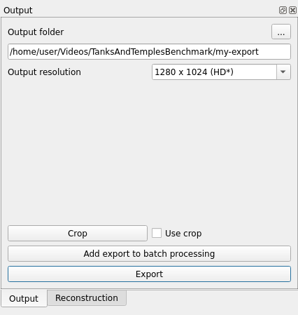

# intelligent Video Sampler 3D 

 

>iVS3D is a framework for intelligent pre-processing of image sequences. iVS3D is able to down sample entire videos to a specific frame rate, as well as to resize and crop the individual images. Furthermore, thanks to the modular architecture, it is easy to develop and integrate plugins with additional algorithms. We provide three plugins as baseline methods that enable an intelligent selection of suitable images and can enrichthem with additional information. To filter out images affected by motion blur, we developed a plugin that detects these frames and also searches the spatial neighbourhood for suitable images as replacements. The second plugin uses optical flow to detect redundant imagescaused by a temporarily stationary camera. In our experiments, we show how this approach leads to a more balanced image sampling if the camera speed varies, and that excluding such redundant images leads to a time saving of 8.1 % for our sequences.

[Link to paper] submitted for the 16th International Symposium on Visual Computing (ISVC 2021).


## Features

- Import of images and videos (.jpg, .jpeg, .png, ..., .mp4, .mov, ...)
- Drag and drop to import images, videos and open projects
- Baseline plugins for sampling:
    - _Nth Frame_ Algorithm (selects every N-th frame)
    - _Stationary Camera Detection_ Algorithm (selects images based on camera movement)
    - _Blur_ Algorithm (avoid blurry images)
    - More _Sampling_-Algorithms can be added using the plugin interface
- Semantic segmentation to mask challenging areas in the input images to prevent these from being processed
    - More _Transformation_-Algorithms can be added using the plugin interface
- Export with user selected resolution and ROI (_Region of Interest_)
- Optimised [COLMAP] Interface
    - Start of a 3D reconstruction with 2 clicks (project.ini will be generated automatically)
- GPU proccesing with [NVIDIA CUDA Toolkit API]
- Use multiple plugins at once with the batch proccesing
- Can be used in a headless mode
- Supported Plattforms: Windows and Linux


Graphical user interface which is split in five different sections. 1. Input, 2. Sampling, 3. Output, 4. Batch processing and 5. Video player with the timeline for keyframes.

## Plugins

There are currently 4 plugins implemented:

| Plugin | Description |
| ------ | ------ |
| NthFrame | Selects every N-th frame |
| Stationary Camera Detection | Selects images based on camera movement |
| Blur | Avoids blurry images |
| GeoMap | Display and select keyframes on a geographic map, based on the GPS information in the EXIF data.


These plugins show different approaches to selecting keyframes. iVS3D is build with an open plugin interface for adding new plugins. See [here](doc/create_plugin.md) on how to create your own plugin.

## 3D Reconstruction
iVS3D does prepare the data for 3D reconstruction. For now we do not perform the reconstruction itself. On windows iVS3D provides functionality to configure and start [COLMAP] which performs the reconstruction on the prepared data. This saves time and simplifies the reconstruction process. Make sure to install python 3.9 or later for the reconstruction! 

> the next section is linux only: OTS integration of colmap is not supported on windows yet!

With the latest update we introduce a seamless integration of [COLMAP] in our software. In the new *Reconstruction* tab you can configure and start colmap reconstructions, view the reconstruction progress, manage the queue and open the finished products.

Reconstruction can be configured to be executed on the local machine or on a remote machine such as a GPU server. Further information:
- [local colmap execution](doc/local_colmap_execution.md)
- [remote colmap execution](doc/remote_colmap_execution.md)

## Getting started
To guide you through a basic workflow with iVS3D, we provide a tutorial which relies on the linux version. To follow along, download one of our latest [Ready-To-Use Builds](#ready-to-use-builds-for-windows-and-linux) for Debian 11 or Ubuntu 22.04, or [compile from source](#build-from-source) for your platform.

Download a video from the [Tanks and Temples Benchmark](https://www.tanksandtemples.org/), we use the Ignatius video from their training data section.

Run `iVS3D-core` and import the video. This can be done using the `Open Input Video` action in the `File`-menu at the top. Alternatively you can drag and drop the video into the application. Now you can preview the video:


In the timeline underneath the preview, all 7844 images are labeld as keyframes which is indicated by the red line. We want to reduce the amount of keyframes to speed up the reconstruction, so we use the `NthFrame`-Plugin to sample down to one frame per second. In the `Sampling`-tab, select the `NthFrame` plugin and hit `Sample images`. Now we are down to 262 keyframes. To improve the quality of the images, we also run the `Blur` plugin. This will replace blurred keyframes with better images in the neighbourhood. This might take a few minutes since we are processing 4K images.

Once the algorithm finished, we can export the keyframes. In the `Output`-tab select a fitting location and name for this set of keyframes. We choose `my-export` in the example. You can also change the resoultion of the images. To speed things up, we reduce the image resoultion to HD and hit export:



Now the images have been written to the disk. Open your file-explorer and navigate to the export location you chose to see the result. We can use the images to create a 3D point-cloud with Colmap. For this follow the instructions [here](doc/remote_colmap_execution.md).


## Ready to use builds for Windows and Linux

We provide builds with and without CUDA for multiple platforms and distributions:
- Windows 10
- Debian 11
- Ubuntu 22.04

Check the latest release to get a build for your platform!

Note that the CUDA builds support GTX 10xx and RTX series GPUS. Older GPUs or Laptop GPUs might require to build iVS3D from sources with an OpenCV and CUDA build for that specific GPU.

<!-- To use the included plugin for semantic segmentation you can download the models we used in our paper:
[Link to models]

To use other models, they have to be in the .onnx format. In addition, the plug-in requires a file that maps the classes to specific colors. -->

## Build from source
### Dependencies

iVS3D and the baseline plugins use:
- [OpenCV] 4.7.0
- [Qt] Framework 5.15.2

For CUDA support:
- [NVIDIA CUDA Toolkit API] 12.0

For windows we use [MSVC] compiler which is shipped with visual studio. On linux we use [GCC] 10 compiler.

The required dependencies can be imported using the _3rdParty.pri_ file. Further information about including dependencies using _.pri_ files can be found [here](doc/3rdparty.md).

### 2 ways to build iVS3D
- Open and build with [Qt Creator](doc/build_qtcreator.md)
- Deploy using automated script on [Windows](doc/build_win.md) or [Linux](doc/build_linux.md)

## Tests

To create the test build add ```"CONFIG+=test"``` as an qmake argument to your build configuration. 
Now you can run the tests within the Test Result tab in Qt Creator.

[Link to our test data]

## Future Work
- [ ] Add remote colmap execution for windows
- [ ] Add seemless colmap integration for windows

## Licence

see [Licences.txt](Licences.txt)

## Citations

- Knapitsch et al.: _Tanks and Temples Benachmark_ (2017): [website](https://www.tanksandtemples.org/)

## Authors

Patrick Binder, Daniel Brommer, Lennart Ruck, Dominik Wüst, Dominic Zahn

Fraunhofer IOSB, Karlsruhe

Supervisor: Max Hermann & Thomas Pollok

Created as part of PSE at the Karlsruhe Institut of Technlogy in the winter term 2020/21

  [COLMAP]: https://demuc.de/colmap/
  [OpenCV]: https://github.com/opencv
  [Qt]:     https://www.qt.io
  [MSVC]:   https://www.microsoft.com/de-de/download/details.aspx?id=48159
  [GCC]:    https://gcc.gnu.org
  [Python]: https://www.python.org/downloads/
  [NVIDIA CUDA Toolkit API]:    https://developer.nvidia.com/cuda-zone
  [cuDNN]:  https://developer.nvidia.com/cudnn
  [Link to paper]: https://arxiv.org/abs/2110.11810
  [Link to models]: https://drive.google.com/drive/folders/122EDO4UxhEYRy5MI1OIpePnsibwGGXjA?usp=sharing
  [Link to our test data]: https://drive.google.com/drive/folders/1hPFtDqQKF9JzBpNTV016unL7awRCsxNj?usp=sharing
