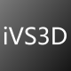
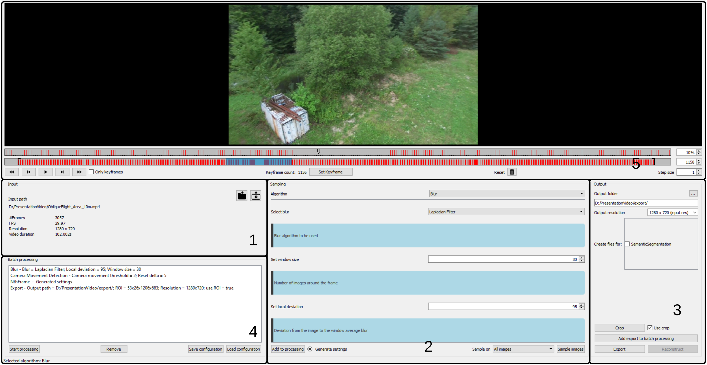

# intelligent Video Sampler 3D 

 

>iVS3D is a framework for intelligent pre-processing of image sequences. iVS3D is able to down sample entire videos to a specific frame rate, as well as to resize and crop the individual images. Furthermore, thanks to the modular architecture, it is easy to develop and integrate plugins with additional algorithms. We provide three plugins as baseline methods that enable an intelligent selection of suitable images and can enrichthem with additional information. To filter out images affected by motion blur, we developed a plugin that detects these frames and also searches the spatial neighbourhood for suitable images as replacements. The second plugin uses optical flow to detect redundant imagescaused by a temporarily stationary camera. In our experiments, we show how this approach leads to a more balanced image sampling if the camera speed varies, and that excluding such redundant images leads to a time saving of 8.1 % for our sequences.

[Link to paper] submitted for the 16th International Symposium on Visual Computing (ISVC 2021).


## Features

- Import of images and videos (.jpg, .jpeg, .png, ..., .mp4, .mov, ...)
- Drag and drop to import images, videos and open projects
- Baseline plugins for sampling:
    - _NthFrame_ Algorithm (selects every N-th frame)
    - _CameraMovement_ Algorithm (selects images based on camera movement)
    - _Blur_ Algorithm (avoid blurry images)
    - More _Sampling_-Algorithms can be added using the plugin interface
- Semantic segmentation to mask challenging areas in the input images to prevent these from being processed
    - More _Transformation_-Algorithms can be added using the plugin interface
- Export with user selected resolution and ROI (_Region of Interest_)
- Optimised [COLMAP] Interface
    - Start of a 3D reconstruction with 2 clicks (project.ini will be generated automatically)
- GPU proccesing with [NVIDIA CUDA Toolkit API]
- Use multiple plugins at once with the batch proccesing
- Can be used in a headless mode
- Supported Plattforms: Windows and Linux


Graphical user interface which is split in five different sections. 1. Input, 2. Plugins, 3. Export,
4. Batch processing and 5. Video player with the timeline for keyframes.

## Plugins

There are currently 4 plugins implemented:

| Plugin | Description |
| ------ | ------ |
| NthFrame Plugin | Selects every N-th frame |
| Stationary Camera Plugin | Selects images based on camera movement |
| Blur Plugin | Avoids blurry images |
| SemanticSegmentation Plugin | Masks images |

These plugins show different approches to selecting keyframes. iVS3D is build with an open plugin interface for adding new plugins. See [here](doc/create_plugin.md) on how to create your own plugin.

## 3D Reconstruction
iVS3D does prepare the data for 3D reconstruction. For now we do not perform the reconstruction itself. On windows iVS3D provides functionality to configure and start [COLMAP] which performs the reconstruction on the prepared data. This saves time and simplifies the reconstruction process. 

> the next section is linux only: OTS integration of colmap is not supported on windows yet!

With the latest update we introduce a seemless integration of [COLMAP] in our software. In the new *Reconstruction* tab you can configure and start colmap reconstructions, view the reconstruction progress, manage the queue and open the finished products.

Reconstruction can be configured to be executed on the local machine or on a remote machine such as a GPU server. Further information:
- [local colmap execution](doc/local_colmap_execution.md)
- [remote colmap execution](doc/remote_colmap_execution.md)

## Dependencies

iVS3D and the baseline plugins use:
- [OpenCV] 4.5.0
- [Qt] Framework 5.12

For CUDA support:
- [NVIDIA CUDA Toolkit API] 10.1
- [cuDNN] 8.0

For windows we use [MSVC] 2015 compiler. On linux we use [GCC] compiler.

The required dependencies can be imported using the _3rdParty.pri_ file.

## Ready to use builds for Windows and Linux

We provide builds with and without CUDA for multiple platforms and distributions:
- Windows 10
- Debian 10
- Debian 11
- Ubuntu 18
- Ubuntu 22

To use the included plugin for semantic segmentation you can download the models we used in our paper:
[Link to models]

To use other models, they have to be in the .onnx format. In addition, the plug-in requires a file that maps the classes to specific colors.

The CUDA compute capabilities vary depending on the platform:
| CUDA version 	| GPUs (exemplary)    | Windows | Debian | Ubuntu
|---------------|---------------------|---------|--------|-----
|	5.0    	    |	GeForce GTX 7XX   | ✅      | -    | -
|	5.2    	    |	GeForce GTX 9XX   | ✅      | -    | -
|	6.1	        |   GeForce GTX 10XX  | ✅      | -    | -
|	7.5	        |   GeForce RTX 20XX  | ✅      | -    | -
|   8.6         |   GeForce RTX 30XX  | -        | ✅  | -

## Build from source

[Build from source with Qt Creator](doc/build_qtcreator.md)

[Deploy from source for windows](doc/build_win.md)

[Deploy from source for linux](doc/build_linux.md)

## Tests

To create the test build add ```"CONFIG+=test"``` as an qmake argument to your build configuration. 
Now you can run the tests within the Test Result tab in Qt Creator.

[Link to our test data]

## Future Work
- [ ] Add remote colmap execution for windows
- [ ] Add seemless colmap integration for windows

## Licence

see [Licences.txt](Licences.txt)

## Authors

Patrick Binder, Daniel Brommer, Lennart Ruck, Dominik Wüst, Dominic Zahn

Fraunhofer IOSB, Karlsruhe

Supervisor: Max Hermann & Thomas Pollok

Created as part of PSE at the Karlsruhe Institut of Technlogy in the winter term 2020/21

  [COLMAP]: <https://demuc.de/colmap/>
  [OpenCV]: <https://github.com/opencv>
  [Qt]:     <https://www.qt.io>
  [MSVC]:   <https://www.microsoft.com/de-de/download/details.aspx?id=48159>
  [GCC]:    <https://gcc.gnu.org>
  [NVIDIA CUDA Toolkit API]:    <https://developer.nvidia.com/cuda-zone>
  [cuDNN]:  <https://developer.nvidia.com/cudnn>
  [Link to paper]: <https://arxiv.org/abs/2110.11810>
  [Link to models]: <https://drive.google.com/drive/folders/122EDO4UxhEYRy5MI1OIpePnsibwGGXjA?usp=sharing>
  [Link to our test data]: <https://drive.google.com/drive/folders/1hPFtDqQKF9JzBpNTV016unL7awRCsxNj?usp=sharing>
