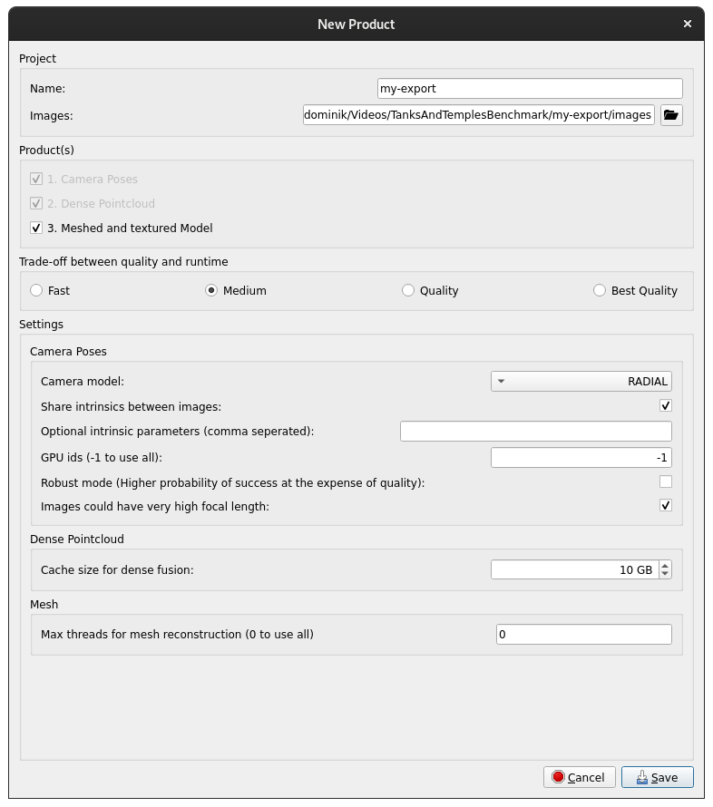

[Documentation](../README.md) / Local colmap execution

# Local colmap execution
> linux only

## Overview
Since 3D reconstruction tools such as Colmap do have a large variety of configuration options, using such tools can be quite complicated and a lot of parameters need to be set every time a reconstruction is started. To simplify the use of such software, the setup, execution and monitoring of Colmap has been integrated seamlessly into our application. This allows the user to start the reconstruction from within iVS3D with only few clicks and easy to understand configuration options. Furthermore the progress of Colmap is displayed. The user can choose whether to run Colmap on their local machine or on a remote machine using ssh. Further information on remote execution can be found [here](remote_colmap_execution.md).

Colmap is a state-of-the-art tool for Structure-from-Motion applications, so it is designed to reconstruct 3D point-clouds from 2D images or videos. It is a standalone application and not our property, so we do not include it in iVS3D nor do we provide ready-to-use builds. However, Colmap is open-source, so you can download the code and compile it yourself. Alternatively you might find builds for your platform somewhere alse, f.e. apt does provide a colmap package as well. Note that for generating a _Dense Point Cloud_, CUDA support is required by Colmap, so make sure you download or compile a version with full support of CUDA to enable this feature!

The point-clouds created by Colmap can be processed further to obtain a meshed and textured 3D-model. For this OpenMVS can be used. Similar to Colmap, it is not allways trivial to setup OpenMVS and requires additional configuration from the user. We provide an OpenMVS integration in our software as well. Similar to Colmap, you need to download and compile OpenMVS yourself.

With Colmap and OpenMVS installed on your machine, iVS3D provides all functionallity needed to create a textured 3D mesh from an image sequence or video.

## Requirements
- Colmap 3.8 (without CUDA only _Sparse Point Cloauds_ can be created, so preferably use Colmap with CUDA)
- OpenMVS (optional, requires _Dense Point Clouds_ from Colmap, so make sure your build supports CUDA)
- Screen (can be installed using `sudo apt install screen`)
- Python 3.9 or later
> make sure Colmap and OpenMVS do run on your system!

## Setup

To integrate your Colmap and OpenMVS with our application, start iVS3D and open the `ColmapWrapper-Settings` in the `Settings` at the top.

To run the recunstruction workflow on your local machine, select `Local` at the top! You ned to specify a workspace folder on your machine, this folder will be used to store intermediate date of Colmap as well as the final results such as your 3D point-clouds from Colmap or meshes produces by OpenMVS.

You need to point iVS3D to the colmap-binary you installed. The Colmap binary might be found automatically if its location is on your PATH. Otherwise you have to set that location yourself.

Optionally you can integrate OpenMVS, by setting it's location as well. Since OpenMVS consists of multiple executables, point to the folder that contains these executables. If you leave this field empty, OpenMVS cannot be used.

Hit `Apply` to test your setup. If the workspace and the binaries are found as expected by iVS3D, you can close the dialog. This setup is stored on your machine so it is enough to do it once.

## Workflow
Before we can reconstruct a 3D point-cloud with colmap or a textured mesh using OpenMVS, we need to import a video or image sequence and select keyframes to use for the reconstruction. For this you can follow the instructions in the [Getting Started](../README.md#getting-started)-section. Make sure you exported the keyframes before proceeding.

Switch from the `Output`-tab to the `Reconstruction`-tab at the bottem right and hit the `New Product`-button. If the button is disabled, your setup is not correct and you might need to check it in the ColmapWrapper-Settings!

In the `New Product`-dialog, your last export is selected ath the top. Below, you can choose the products you want to created. The _Camera Poses_ and _Dense Point Cloud_ are computed using Colmap. The _meshed and textured Model_ is only available if OpenMVS is installed as well.

Select a quality preset, note that for better quality the reconstruction will take longer. For each product you can configure a few parameters if needed.

If you are done with your configuration, hit `Save` and the reconstruction will be started. You can monitor the progress in iVS3D.

Don't be shocked if no progress is made for a couple of minutes, depending on the number of frames and the computational power of your machine such a reconstruction might take from a few hours up to multiple days! To see whats going on in detail, you can hit the `Open log file`-button in the `Reconstruction`-tab and see the output of colmap/OpenMVS.