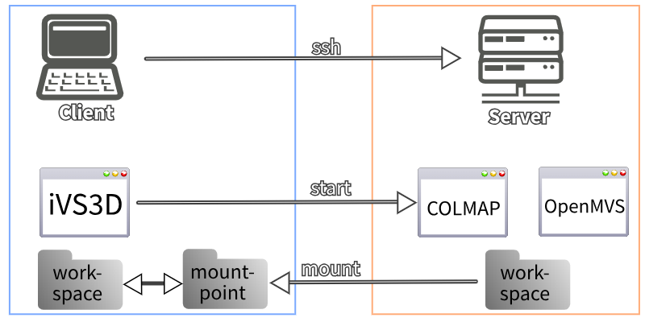

[Documentation](../README.md) / Remote colmap execution

# Remote colmap execution
> linux only

## Overview
In a usual workflow the sampling plugins are used to select keyframes for the following 3D reconstruction. These plugins are optimized to use all processor cores or the GPU and usually scale linearly with the number of images and their resolution, so execution is rather quick even. This is not true for the 3D reconstruction with COLMAP and the meshing and texturing with OpenMVS. Many of these steps do scale quadratic or cubic with the number of images. Because of this we rely on our sampling plugins to reduce the number of images drastically. However even on high-end hardware, the reconstruction and texturing process still takes a significant amount of time, usually from a few hours to multiple days for a high quality reconstruction. On lower-end machines and laptops, reconstructions take even more time. To make use of the fastest hardware available to you and to avoid blocking you PC for many hours, iVS3D offers functionality to run the time-consuming 3d reconstruction, meshing and texturing on a remote server. To make use of this you will need a second computer, f.e. a desktop machine or a GPU server. We refer to this as the *server*. In the following we will call your main system (e.g. your laptop/desktop) the *client*.



Xour source video or image sequence is located on the client and iVS3D will be running there as well to perform the keyframe selection. After exporting the images, iVS3D will transfer them to the server and start the reconstruction using COLMAP and the meshing and texturing using OpenMVS on the server. While this is running you can close iVS3D on the client and do other tasks. Use iVS3D to check the progess. Once the 3D model is finished on your server, iVS3D will copy the results back to your workspace on the client machine.

## Requirements
### Server
- needs to run linux (we tested debian 11)
- install python 3.9 or later
- install COLMAP for 3d reconstruction
- install OpenMVS for meshing and texturing (optinal)
- install screen
- install openssh-server

### Client
- install iVS3D
- install rsync
- install SSHFS

### SSH connection
Communication is done using ssh. You need to setup ssh-server on your server and make sure you can connect to it from your client:
```sh
ssh username@serverip
```
If your server requires a password, make sure to create a ssh-key and copy it to the server using ```ssh-copy-id```, otherwise iVS3D will not be able to start COLMAP and OpenMVS on your server.

### Mount the server workspace to the client
For syncing data between the server and client, iVS3D reuires a folder from the server (we call it *workspace*) to be mounted to the clients file system. We call the mount point on the client *mountpoint*. This can be done using SSHFS.

Do not confuse the workspace on your client, the workspace on your server and the mountpoint! To clarify:
- workspace on client: This folder is located on the client and holds the images as well as the final 3d models once they are finished. It is independent of the server and the files persist if the server shuts down.
- workspace on server: This folder is located on the server and is used during the reconstruction process. The images are copied to this folder. Interdmeiate and final results of the reconstruction are stored here.
- mountpoint on client: This is a path on the client where the workspace from the server is mounted using SSHFS. iVS3D will copy images to this mount point to transfer them to the server and copy the resulting 3d reconstruction back to the client workspace from here as well.

## Setup
After you installed the required tools on the server and client, make yure you enabled ssh-server and mounted the workspace from the server to the mountpoint using SSHFS. Now we can start iVS3D on the client and open the Colmap-Wrapper-Settings. Choose SHH and enter your username and the server ip. You can pick a workspace on your client and select the mountpoint. iVS3D also needs the paths to COLMAP, OpenMVS and the workspace **ON THE SERVER**. Once you entered all the required fields, apply the settings. If you did everything correct, iVS3D will accept your configuration and you can use the application as usual. However now the reconstruction, meshing and texturing will be executed on the server and do not occupy your client machine. 